# A3: Self-Supervised Learning

## Commands Used

### Training
```bash
# SimCLR
py run.py --model simclr --epochs 10 --train

# DINO default
py run.py --model dino --epochs 10 --train

# DINO ablation: no centering
py run.py --model dino --epochs 5 --no-centering --train

# DINO ablation: no local crops
py run.py --model dino --epochs 5 --n-local 0 --train

# MAE mask ratios
py run.py --model mae --mask-ratio 0.25 --epochs 5 --train
py run.py --model mae --mask-ratio 0.50 --epochs 5 --train
py run.py --model mae --mask-ratio 0.75 --epochs 5 --train
```

### Evaluation
```bash
py run.py --model simclr --evaluate --linear
py run.py --model dino --evaluate --linear --attention
py run.py --model dino --no-centering --evaluate --linear --attention
py run.py --model dino --n-local 0 --evaluate --linear --attention
py run.py --model mae --mask-ratio 0.25 --evaluate --linear
py run.py --model mae --mask-ratio 0.50 --evaluate --linear
py run.py --model mae --mask-ratio 0.75 --evaluate --linear
```

## Results

### Main Results Table

| Model | Linear Eval Acc | Time/epoch | Notes |
|---|---|---|---|
| SimCLR (ResNet-18) | 16.16% | ~56s | contrastive baseline |
| DINO (ViT-Tiny) | 48.32% | ~264s | self-distillation |
| DINO (no centering) | 34.13% | ~264s | collapse ablation |
| DINO (no local crops) | 43.29% | ~105s | multi-crop ablation |

### Exercise 1: DINO Ablations

| Setting | Linear Eval Accuracy |
|---|---|
| Default (2 global + 4 local, with centering) | 48.32% |
| No centering (`- self.center` removed) | 34.13% |
| No local crops (`n_local=0`) | 43.29% |

**1a) Center norm across training epochs:**

| Epoch | Center Norm |
|---|---|
| 1 | 0.3033 |
| 2 | 0.8219 |
| 3 | 1.1211 |
| 4 | 1.3021 |
| 5 | 1.3850 |
| 6 | 1.5478 |
| 7 | 1.5340 |
| 8 | 1.6312 |
| 9 | 1.7019 |
| 10 | 1.7644 |

The center norm grows initially and then stabilizes around 1.7, indicating the centering vector converges to a stable estimate of the teacher output distribution mean rather than growing unboundedly.

**1b) Explanation:**

*Why removing centering causes collapse:* Without centering, the teacher network is free to assign all probability mass to a single dominant output dimension, producing nearly the same vector for every image. This is confirmed by the training results: without centering, the loss collapsed from 2.44 to 0.0003 in just 5 epochs — a trivial solution where the student simply learns to copy a constant teacher output. No semantic features are learned, which is reflected in the drop from 48.32% to 34.13% on linear evaluation. Centering prevents this by subtracting the running mean from teacher outputs, making constant outputs impossible since the mean is always subtracted out.

*Why removing local crops hurts representation quality:* The multi-crop strategy forces the student to predict the teacher's global view from a small local patch — a harder and more informative task. Without local crops, both the student and teacher see similarly-scaled global crops, making the task too easy. The model learns less rich features because it never has to infer global context from limited local information. This is reflected in the drop from 48.32% to 43.29% on linear evaluation.

### Exercise 2: MAE Mask Ratio Ablation

| Mask Ratio | Recon Loss | Linear Eval Acc |
|---|---|---|
| 0.25 | 0.6082 | 38.49% |
| 0.50 | 0.5799 | 39.05% |
| 0.75 | 0.5433 | 39.80% |

**Explanation:**

At mask ratio 0.25, only 25% of patches are hidden, making reconstruction too easy — the model can fill in missing patches by copying nearby visible patches without understanding global image semantics. As a result the encoder learns shallow local texture features rather than deep semantic representations, leading to worse linear evaluation accuracy despite having a lower reconstruction loss. At mask ratio 0.75, the harder task of reconstructing 75% of missing content forces the encoder to build a richer global understanding of the image structure, producing better transferable features for downstream classification.

### Exercise 3: Three-Way Comparison

| Metric | SimCLR | DINO | MAE |
|---|---|---|---|
| Backbone | ResNet-18 | ViT-Tiny | ViT-Tiny |
| Needs negative pairs? | Yes | No | No |
| Needs EMA teacher? | No | Yes | No |
| Linear Eval Accuracy | 16.16% | 48.32% | 39.80% |
| Training time/epoch | ~56s | ~264s | ~43s |
| t-SNE cluster quality (1-5) | 2 | 4 | 3 |
| Has interpretable attention maps? | No | Yes | No |

**3a) MAE vs DINO for large-scale pretraining:**

Two reasons MAE won out for large-scale general pretraining: first, MAE is significantly simpler and faster — no teacher network, no EMA updates, no multi-crop pipeline. Our results confirm this: MAE trains in ~43s/epoch vs DINO's ~264s/epoch, making it 6x faster and much more practical at scale. Second, MAE scales better with model size and data volume — at large scale with ViT-Large and datasets like ImageNet-21k, the pixel reconstruction signal becomes extremely rich and MAE representations outperform DINO on general benchmarks like image classification and object detection.

One reason DINO is still preferred for CV-only tasks like segmentation: DINO's self-attention maps naturally segment objects from background without any segmentation supervision. The [CLS] token learns to attend to semantically meaningful foreground regions, making DINO features directly useful for dense prediction tasks. This emergent spatial structure does not arise in MAE, whose encoder is optimized for reconstruction rather than semantic grouping.

**3b) Medical image segmentation with 500 labeled scans:**

DINO pretraining is the better choice for this scenario. With only 500 labeled scans, the quality of pretrained features matters more than training speed or scale. DINO produces spatially structured representations — its attention maps already segment foreground from background without any labels, which directly benefits a downstream segmentation model that needs to learn precise object boundaries. Fine-tuning a DINO-pretrained ViT encoder on 500 medical scans would yield stronger segmentation performance than MAE or SimCLR, because DINO features are already organized around semantic regions and object boundaries rather than pixel-level texture reconstruction or instance-level discrimination.

## Visualizations

### Loss Curves

**SimCLR Loss**
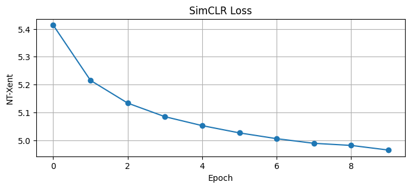

**DINO Loss (default)**
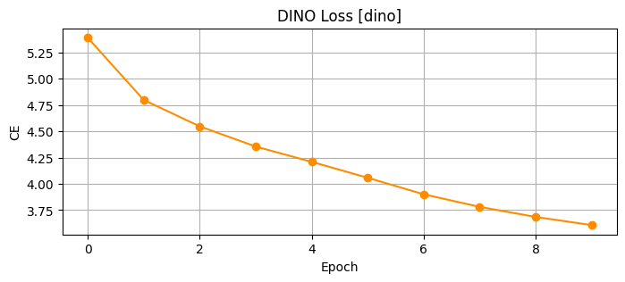

**DINO Center Norm**
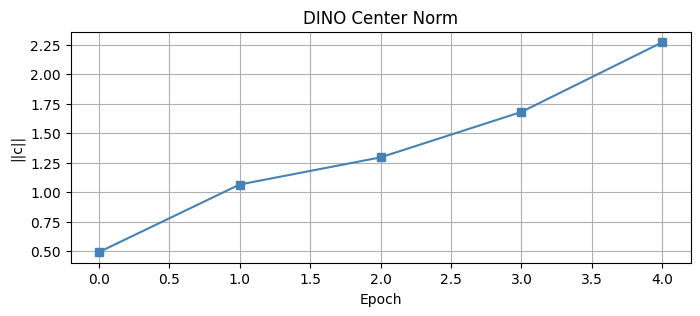

**DINO No Centering Loss (collapse visible — loss drops to ~0)**
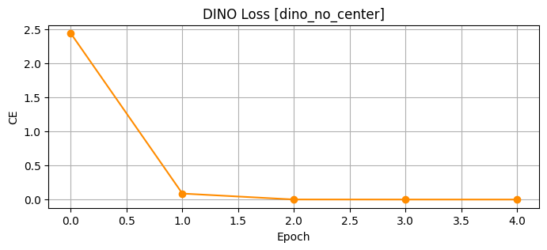

**DINO No Local Crops Loss**
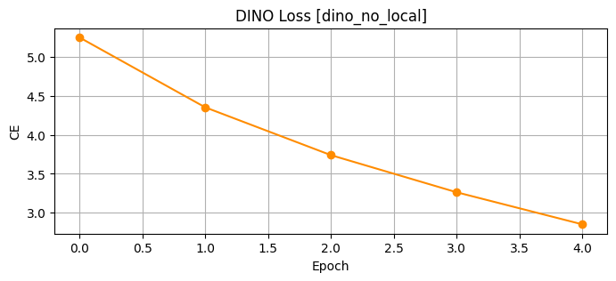

**MAE Loss Curves**
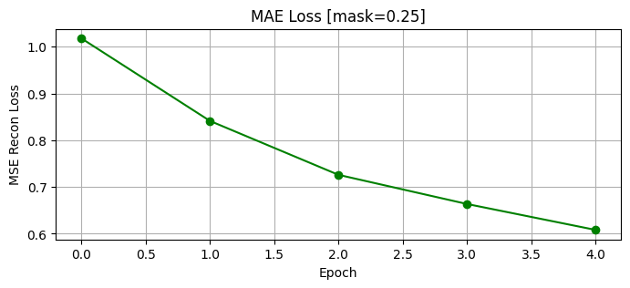
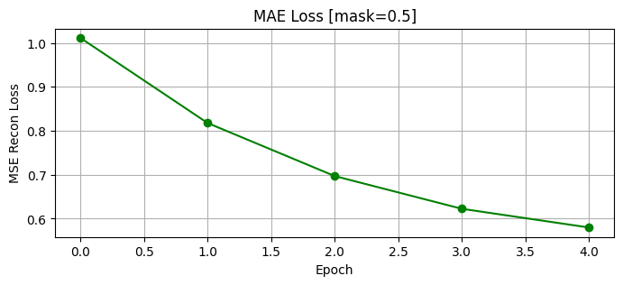
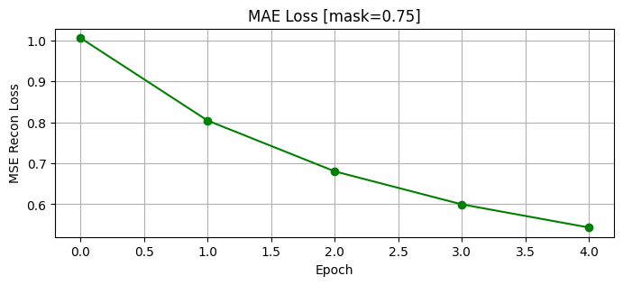

### Attention Maps

**DINO Default — [CLS] token attention heads per image**
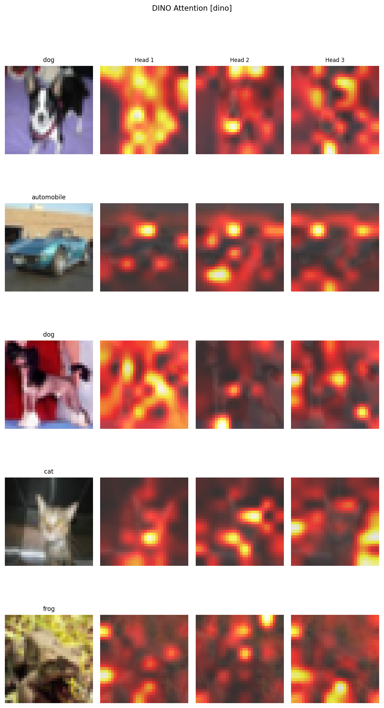

**DINO No Centering — attention maps after collapse**
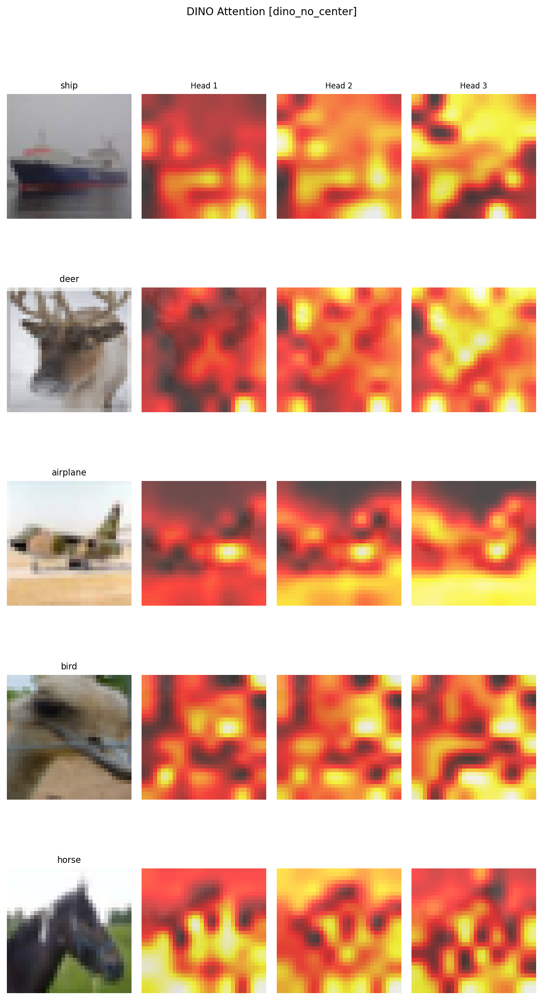

**DINO No Local Crops — attention maps without multi-crop**
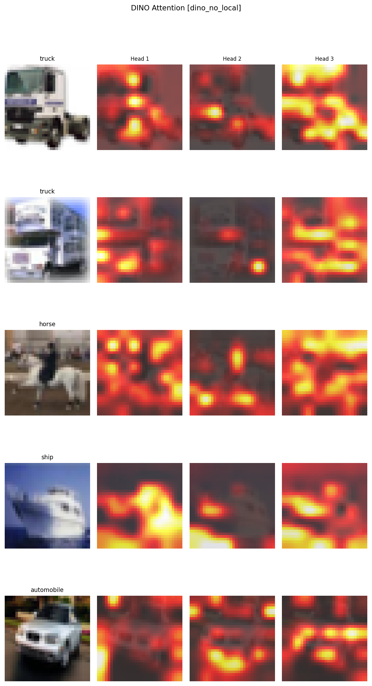

### t-SNE Feature Space Comparison

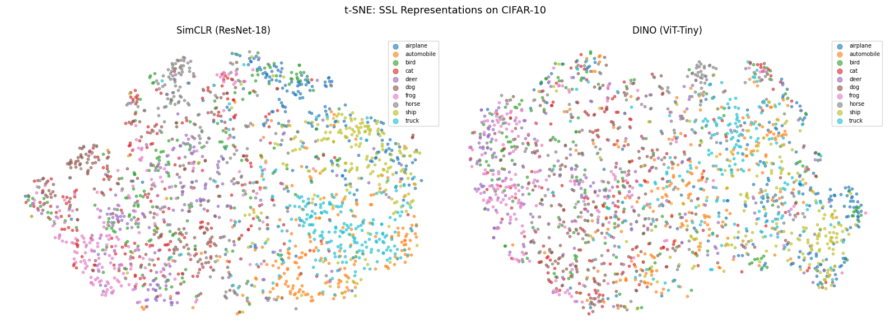