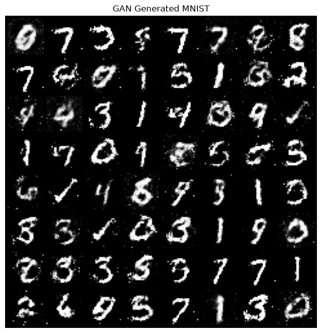
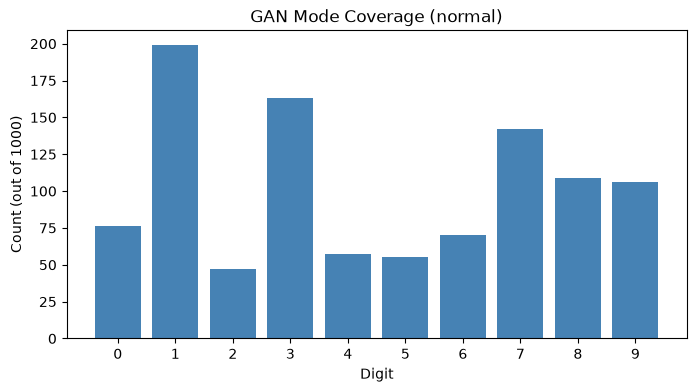
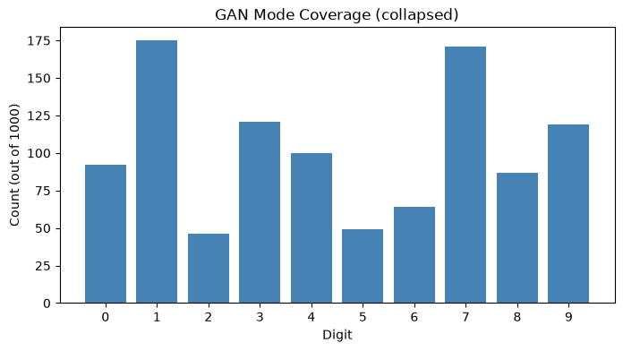
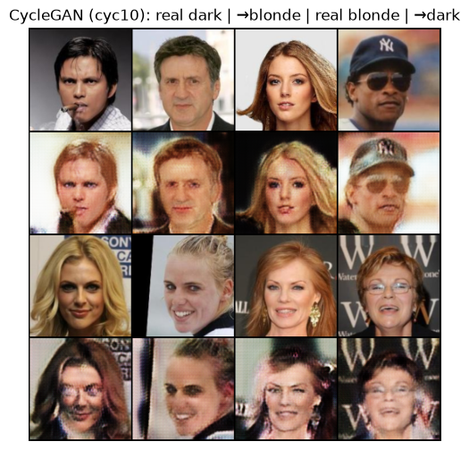
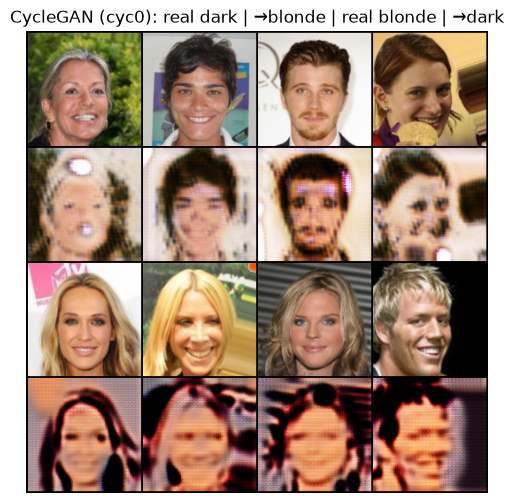
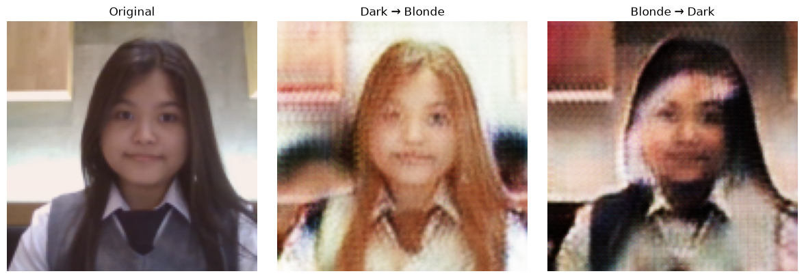
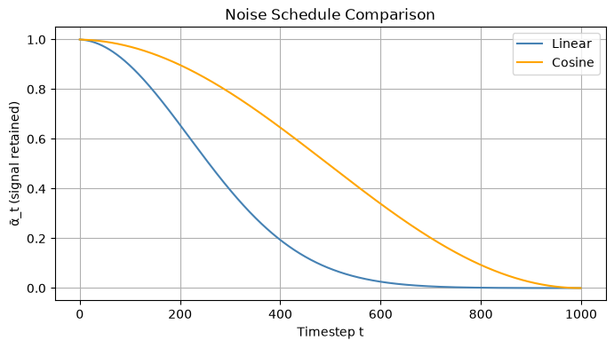
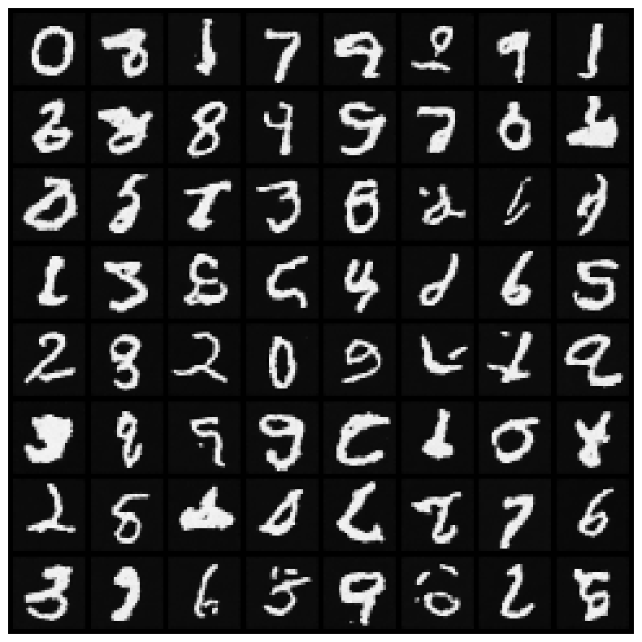
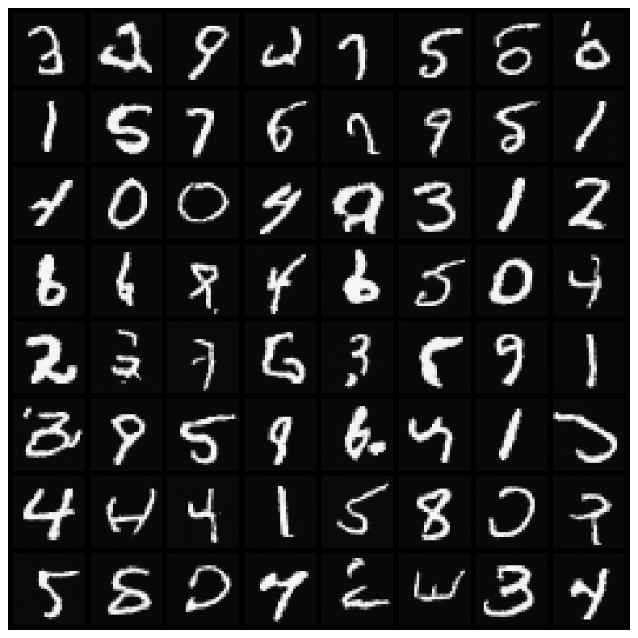
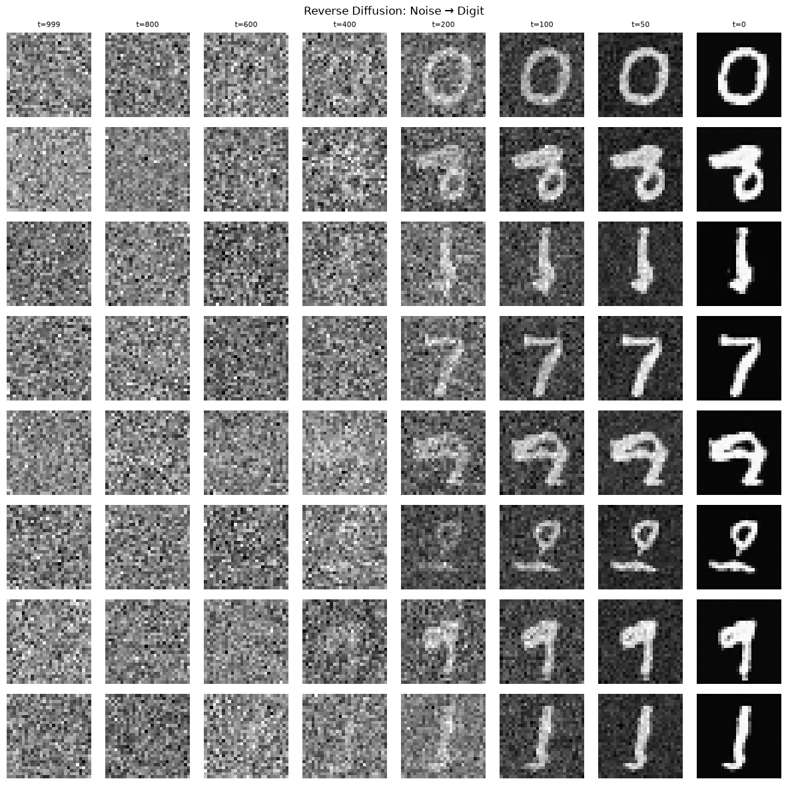

# A4 Generative Models

This repository contains the training and evaluation code for the GAN, CycleGAN, and DDPM experiments.

## Commands Used

```bash
uv run run.py --model gan --dataset mnist --epochs 20 --train
uv run run.py --model gan --weights saved/gan_mnist.pt --mode-collapse-check
uv run run.py --model ddpm --dataset mnist --epochs 20 --schedule linear --train
uv run run.py --model ddpm --dataset mnist --epochs 10 --schedule linear --train
uv run run.py --model ddpm --dataset mnist --epochs 20 --schedule cosine --train
uv run run.py --model ddpm --schedule linear --weights saved/ddpm_mnist_linear.pt --generate --n 64
uv run run.py --model cyclegan --dataset celeba --epochs 20 --celeba-subset 5000 --batch-size 32 --num-workers 2 --log-every 10 --skip-ablation --train
uv run run.py --model cyclegan --dataset celeba --epochs 10 --celeba-subset 5000 --batch-size 32 --num-workers 2 --lambda-cyc 0 --log-every 10 --skip-ablation --train
uv run run.py --model cyclegan --weights saved/cyclegan_celeba_cyc10.pt --test-image my_face.jpg
```

I also used `./run_all.sh` as a resume-friendly script for running missing outputs continuously.

## Results Summary

| Model | Dataset | Visual Quality | Training Time | Notes |
|---|---|---|---|---|
| Vanilla GAN | MNIST | 3/5 | about 2 min | produces recognizable digits, but digit frequencies are uneven |
| CycleGAN | CelebA | 3/5 | about 16 min for lambda=10 on 5000-image subset | dark-to-blonde and blonde-to-dark translations work, but faces are softened |
| DDPM linear | MNIST | 4/5 | about 17 min | epoch 10 loss 0.0258; baseline diffusion samples are clear |
| DDPM cosine | MNIST | 4/5 | about 11 min | epoch 20 loss 0.0400; samples are clear and diverse |

## Exercise 1: GAN Mode Collapse

### Normal GAN

| Digit | 0 | 1 | 2 | 3 | 4 | 5 | 6 | 7 | 8 | 9 |
|---|---|---|---|---|---|---|---|---|---|---|
| Count (out of 1000) | 76 | 199 | 47 | 163 | 57 | 55 | 70 | 142 | 109 | 106 |

The normal GAN covers all 10 digits, but not evenly. Digits 1, 3, and 7 appear much more often than digits such as 2, 4, and 5.





### Collapsed GAN, discriminator learning rate = 6e-4

| Digit | 0 | 1 | 2 | 3 | 4 | 5 | 6 | 7 | 8 | 9 |
|---|---|---|---|---|---|---|---|---|---|---|
| Count (out of 1000) | 92 | 175 | 46 | 121 | 100 | 49 | 64 | 171 | 87 | 119 |

No digit completely vanished, but the distribution is still imbalanced. Digits 2, 5, and 6 are underrepresented, while digits 1 and 7 dominate.



Two techniques that help prevent mode collapse are WGAN-style training and minibatch discrimination. WGAN replaces the original GAN objective with a Wasserstein distance estimate, which gives the generator a smoother and more informative training signal. Minibatch discrimination lets the discriminator compare samples within a batch, making it easier to penalize generators that repeatedly produce nearly identical outputs.

## Exercise 2: CycleGAN Ablation

| Setting | Visual quality | Face structure preserved? | Notes |
|---|---|---|---|
| lambda_cyc = 10 | Better | Partially | Hair color changes are visible while identity and pose are somewhat preserved, although faces become blurry. |
| lambda_cyc = 0 | Worse | Poorly | The model changes appearance more aggressively but loses facial details and introduces strong artifacts. |

Default CycleGAN result:



Ablation with cycle consistency disabled:



When cycle consistency is removed, the generator can "cheat" by producing any image that fools the target-domain discriminator, even if it no longer preserves the input person's structure. The cycle loss forces the translated image to map back to the original, so without it the model has much less pressure to keep identity, pose, and background consistent.

## Exercise 3: Own Face Style Transfer



The model changes the hair color, but it only partially preserves the face structure. The eyes, nose, and clothing remain roughly aligned, but the face becomes blurred and the background is distorted. This is expected because adversarial loss encourages target-domain realism, while cycle consistency encourages reconstructing the input; neither guarantees perfect identity preservation.

My photo is different from the CelebA celebrity training distribution in pose, lighting, background, and possibly age/ethnicity. Because of that domain shift, the translation is less clean than the CelebA examples and produces stronger blur/artifacts.

## Exercise 4: DDPM Noise Schedule Ablation

The cosine beta schedule was implemented in `run.py` using the Nichol and Dhariwal schedule. The cosine schedule preserves signal longer early in the forward diffusion process, which is visible in the alpha-bar plot.



| Schedule | Loss at epoch 10 | Visual quality (1-5) | Notes |
|---|---:|---:|---|
| Linear | 0.0258  | 4 | clear MNIST-like samples, but training took longer |
| Cosine | 0.0427  | 4 | clear samples; preserves signal longer at early timesteps |

Linear DDPM samples:



Cosine DDPM samples:



Reverse denoising trajectory:



The cosine schedule looks at least as good as the linear schedule in these samples. It preserves signal longer at the start because alpha-bar decreases more slowly early in the process, so the model sees less aggressively destroyed images at small timesteps and can learn a smoother denoising trajectory.

## Discussion

GANs are useful when fast sampling is important and the target distribution is relatively simple, but they can suffer from unstable training and mode imbalance. CycleGAN is useful when translating between two unpaired image domains, such as dark hair and blonde hair, because the cycle loss encourages the output to preserve the input structure. Diffusion models are slower to sample but tend to produce stable and diverse results, so I would prefer them for high-quality image generation when inference speed is less important.
