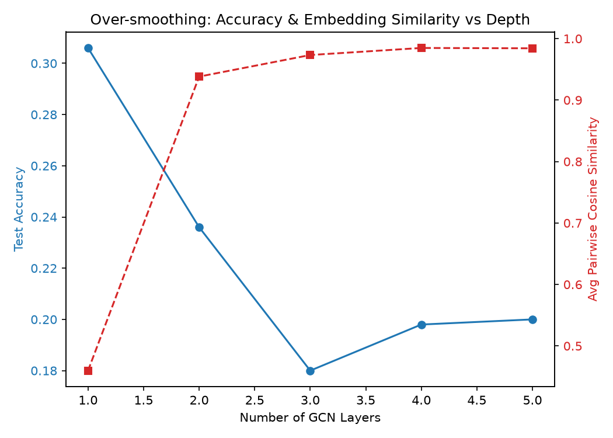
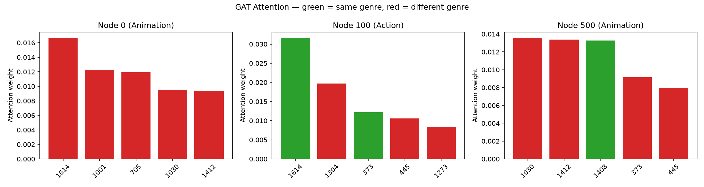
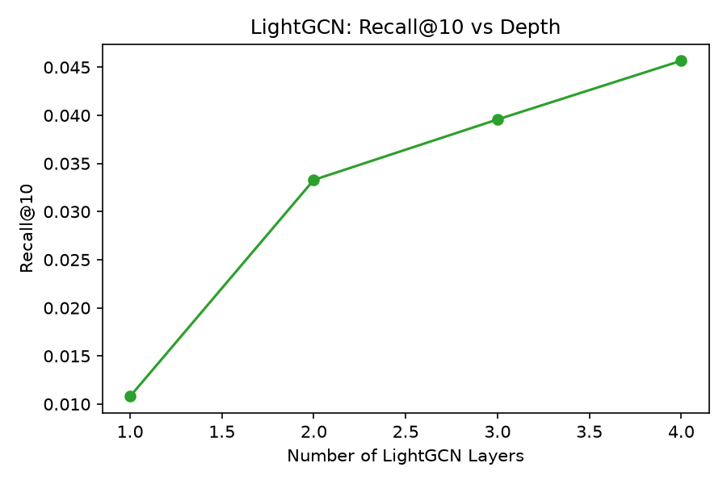
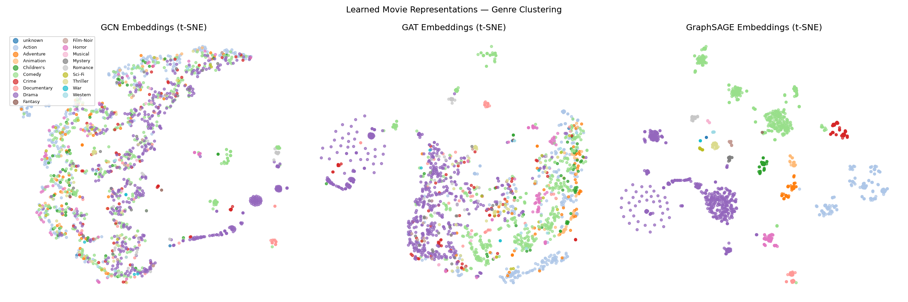

# A5: Graph Neural Networks

## Exercise 1 — Over-smoothing

| # Layers | Test Accuracy | Avg Cosine Similarity |
|---|---|---|
| 1 | 30.60% | 0.4599 |
| 2 | 23.60% | 0.9382 |
| 3 | 18.00% | 0.9733 |
| 4 | 19.80% | 0.9848 |
| 5 | 20.00% | 0.9843 |

## Exercise 2 — GCN vs GAT vs GraphSAGE

| Model | Test Accuracy | Avg Epoch Time (s) |
|---|---|---|
| GCN | 23.60% | 0.00576 |
| GAT (8 heads) | 1.60% | 0.81577 |
| GraphSAGE (k=10) | 96.40% | 0.00300 |

## Exercise 3 — MLP baseline

| Model | Test Accuracy |
|---|---|
| MLP (no graph) | 97.00% |
| GCN | 23.60% |
| GAT | 1.60% |
| GraphSAGE | 96.40% |

## Exercise 4 — LightGCN

| Model | # Params | AUC | Recall@10 |
|---|---|---|---|
| RecGCN (with W) | 79,520 | 0.8226 | 0.0601 |
| LightGCN (no W) | 76,448 | 0.8091 | 0.0396 |

**Depth sweep (LightGCN):**

| # Layers | Recall@10 |
|---|---|
| 1 | 0.0108 |
| 2 | 0.0333 |
| 3 | 0.0396 |
| 4 | 0.0457 |

## t-SNE Embeddings (GCN / GAT / GraphSAGE)

## Discussion

_When would you use a GNN instead of an MLP? Give a concrete example from biology,
traffic routing, or social networks. (2–3 sentences)_

[your answer here]
